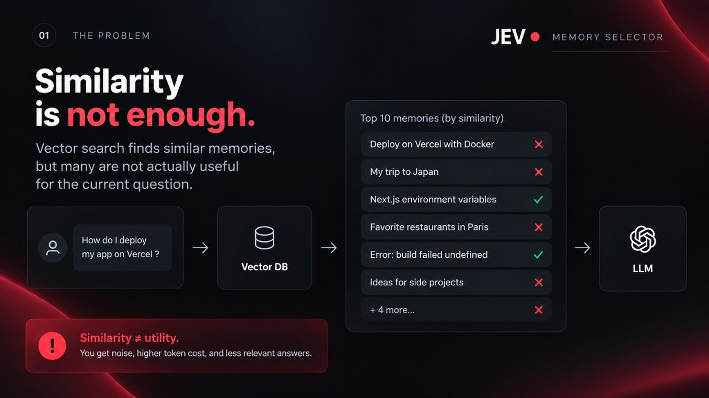
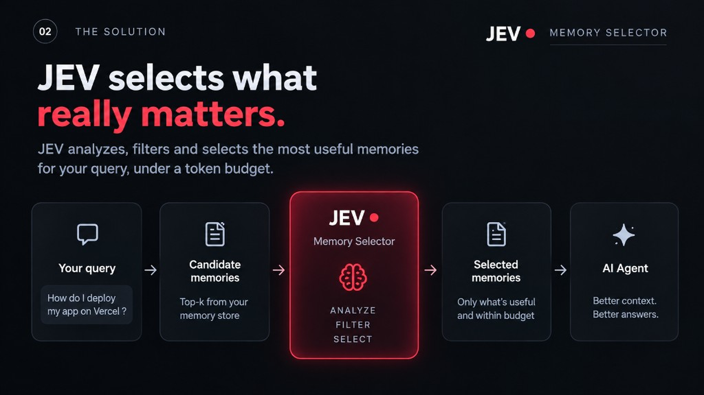
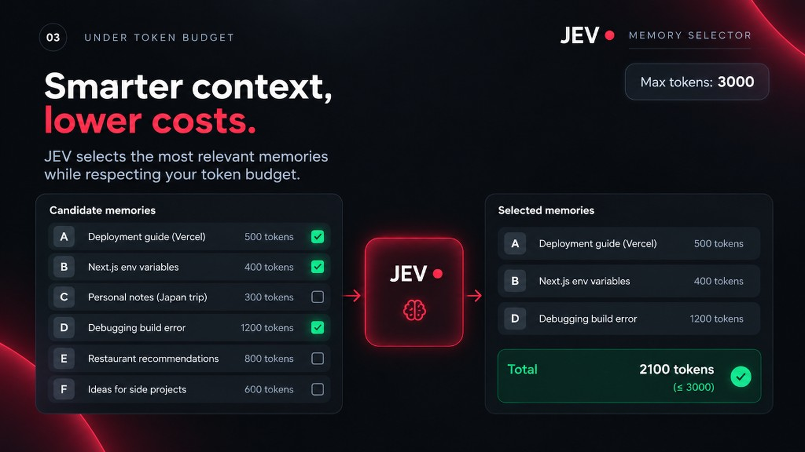
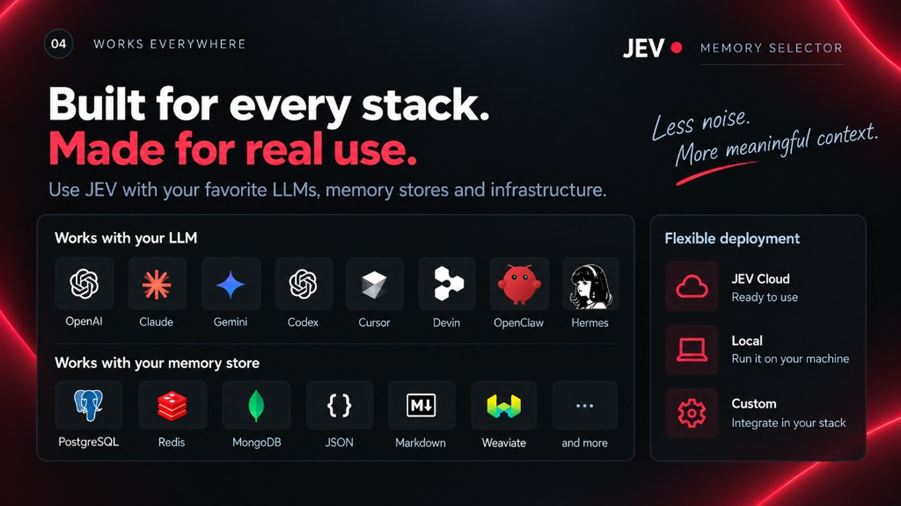

# jev-memory-selector

Filters memories an agent already retrieved, so only what fits the budget is sent.

Author: [Pinuts](https://github.com/Pinutss). MIT license.

Stack: Python 3.10+, HTTP, MCP stdio, Docker, HTML demo.

After `jev-memory serve`: [demo](http://127.0.0.1:8080/)

<p>
  
  
</p>
<p>
  
  
</p>

## Local, no keys

```bash
git clone https://github.com/Pinutss/jev-memory-selector
cd jev-memory-selector
uv sync
uv run jev-memory demo
uv run jev-memory serve
```

`provider=local` by default if you do not set keys. Docker:

```bash
docker compose up
```

## Hermes and OpenClaw

Yes, locally. The MCP process does not need JEV or a gateway:

```bash
uv run jev-memory mcp
```

One tool: `memory_select`. Pass `query` + `memories`. Keys stay in the process environment, not in the call.

**Hermes** (`~/.hermes/config.yaml`):

```yaml
mcp_servers:
  jev-memory:
    command: uv
    args: ["run", "--directory", "/path/to/jev-memory-selector", "jev-memory", "mcp"]
    env:
      JEV_PROVIDER: local
```

Then `hermes mcp test jev-memory` and `/reload-mcp`.

**OpenClaw** (`~/.openclaw/openclaw.json`, or Settings > MCP > Stdio):

```json
{
  "mcp": {
    "servers": {
      "jev-memory": {
        "command": "uv",
        "args": ["run", "--directory", "/path/to/jev-memory-selector", "jev-memory", "mcp"],
        "env": { "JEV_PROVIDER": "local" }
      }
    }
  }
}
```

Copy-ready examples: `examples/hermes.yaml`, `examples/openclaw.json`.

## Python

```python
from jev_memory_selector import MemorySelector

result = MemorySelector(provider="local").select(
    query="How does my backend work?",
    memories=[{"id": "1", "content": "Backend FastAPI"}],
    max_memories=8,
    max_tokens=3000,
)
print(result.texts)
```

## JEV + gateway (optional)

If you wire the cloud later, two keys are enough: `JEV_API_KEY` / `JEV_BASE_URL`, and your gateway (`GATEWAY_API_KEY`, `GATEWAY_BASE_URL`, `GATEWAY_MODEL`). No OpenAI / Anthropic / Gemini key in this repo.

```bash
cp .env.example .env
```

`JEV_PROVIDER=jev` will not start if either side is missing.

## HTTP

```bash
uv run jev-memory serve
```

`GET /healthz`, `POST /v1/select`. Binds `127.0.0.1`. The body must not contain keys.

## Limits

The default counter is about 4 characters per token. In `local` mode, ranking is lexical. Scope isolates lists, it is not auth. No store, no PyPI yet.

`docs/vision.md` is a long-term target, not the current contract.
