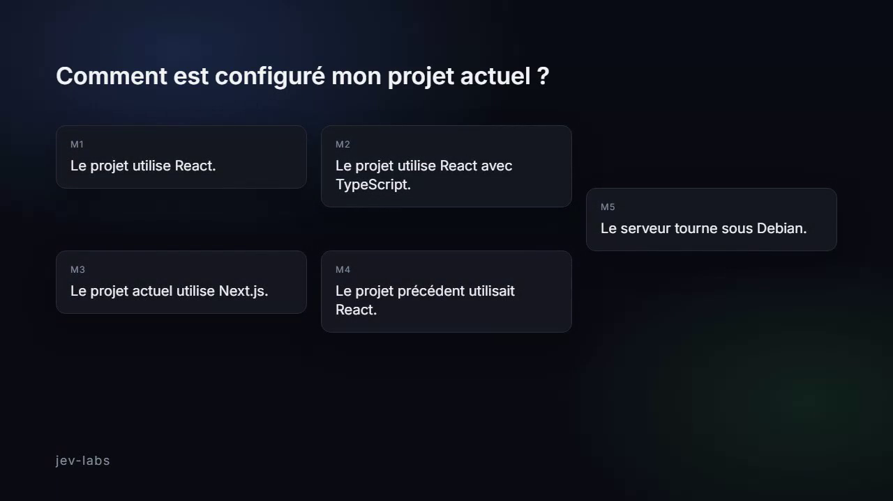
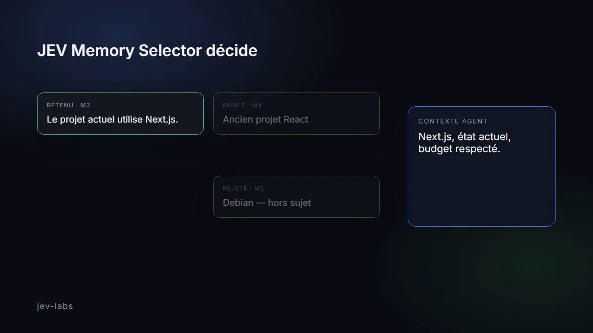

# jev-memory-selector

Sélection de souvenirs pour agents IA, sous budget de tokens.

Premier module de [JEV Labs](https://github.com/Pinutss/jev-labs).


Votre agent n’a pas besoin de plus de mémoire. Il a besoin de la bonne sélection.

[Voir l’aperçu motion (MP4, 18 s)](docs/preview/jev-memory-selector.mp4) · [Page live `/preview`](http://127.0.0.1:8080/preview)

<p>
  
  
</p>

En production, branchez **deux clés** :

- `JEV_API_KEY` + `JEV_BASE_URL` — API de décision JEV
- `GATEWAY_API_KEY` + `GATEWAY_BASE_URL` + `GATEWAY_MODEL` — **votre** gateway (OpenRouter, LiteLLM, Vercel AI Gateway, ou tout endpoint OpenAI-compatible)

Pas de `OPENAI_API_KEY`, `ANTHROPIC_API_KEY` ni `GEMINI_API_KEY` dans ce projet. La clé gateway ne part jamais chez JEV ; la clé JEV ne part jamais chez la gateway.

Projet de [JEV Labs](https://github.com/Pinutss/jev-labs). Licence MIT. Aucun paquet publié sur PyPI.

## Démarrer sans réseau

```bash
uv sync --extra dev
uv run pytest -q
uv run jev-memory demo
uv run python examples/basic.py
```

## Production : JEV + gateway

```bash
cp .env.example .env
# renseigner JEV_* et GATEWAY_*
```

```python
from jev_memory_selector import MemorySelector

selector = MemorySelector(provider="jev")
result = selector.select(
    query="Comment fonctionne mon backend ?",
    memories=[{"id": "1", "content": "Backend FastAPI"}],
    max_memories=8,
    max_tokens=3000,
)
print(result.texts)
```

OpenRouter :

```env
JEV_PROVIDER=jev
JEV_API_KEY=jev_...
JEV_BASE_URL=https://api.example.com/v1/select
GATEWAY_BASE_URL=https://openrouter.ai/api/v1
GATEWAY_API_KEY=sk-or-...
GATEWAY_MODEL=openai/gpt-4o-mini
```

## Autres providers

| Provider | Clés | Réseau |
| --- | --- | --- |
| `local` | aucune | non |
| `mock` | aucune | non (`jev-memory demo`) |
| `custom` | `JEV_BASE_URL` | POST utilisateur |
| `jev` | JEV + gateway | oui |

`HeuristicSelector` reste disponible pour un usage local déterministe.

## HTTP

```bash
uv run jev-memory serve
# GET  http://127.0.0.1:8080/healthz
# POST http://127.0.0.1:8080/v1/select
```

Le corps ne doit pas contenir de clés. Bind par défaut : `127.0.0.1`. Pour `0.0.0.0`, définir `JEV_MEMORY_AUTH_TOKEN`.

```bash
uv run python examples/http_client.py
```

## Docker

```bash
cp .env.example .env
docker compose up
```

L’image démarre en `local` si `JEV_PROVIDER` n’est pas défini. Pour le mode prod, renseignez les deux clés dans `.env` et `JEV_PROVIDER=jev`. Le port est publié sur `127.0.0.1:8080`.

## MCP

```bash
uv run jev-memory mcp
```

Un tool : `memory_select` (`query`, `memories`, limites). Les clés restent dans l’environnement du process.

## Limites

Le compteur par défaut estime un token pour quatre caractères. Le mode `local` est lexical, pas sémantique. Le mode `jev` dépend de l’API JEV et de votre gateway. Les souvenirs sont redactés avant tout appel distant. Le scope est un filtre, pas une authentification. Pas de persistance, pas de sandbox, pas de benchmark publié.

La vision produit longue est dans `docs/vision.md` : ce n’est pas le contrat d’API actuel.
