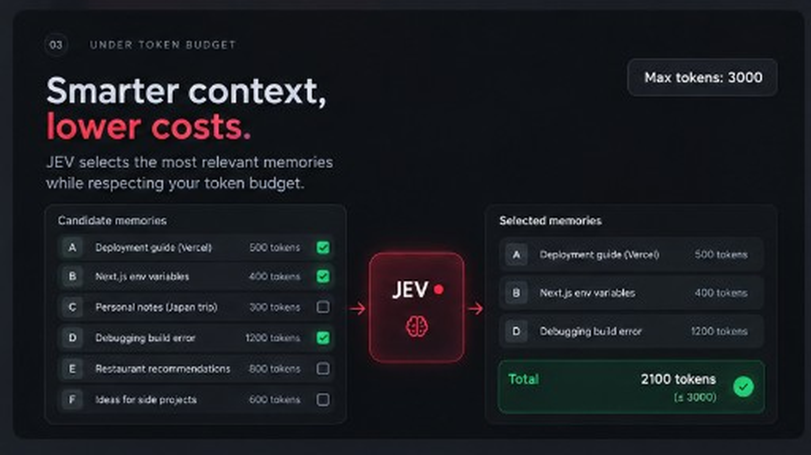
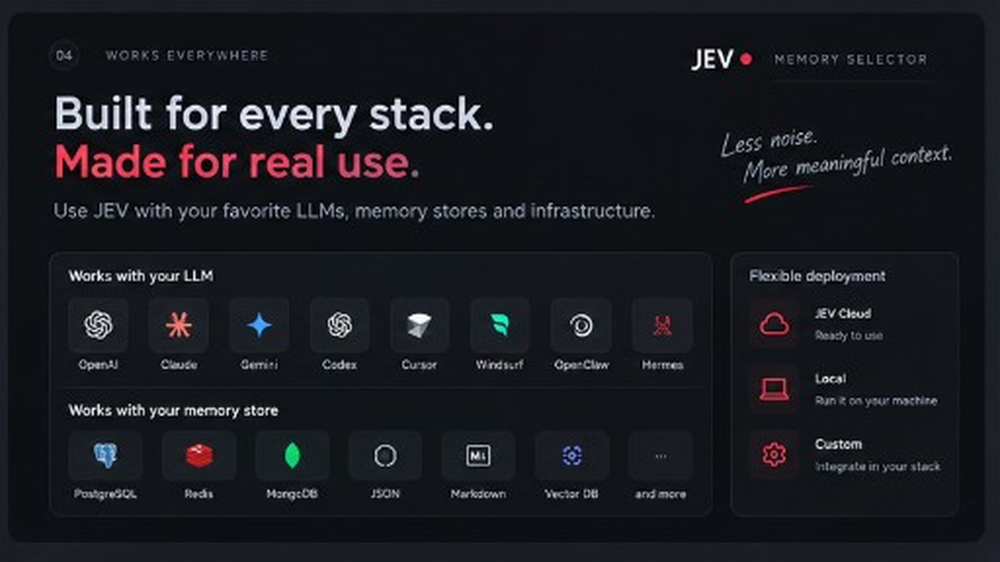

# jev-memory-selector

Filtre les souvenirs qu'un agent a déjà récupérés, pour ne lui en donner que ce qui tient dans le budget.

Auteur : [Pinuts](https://github.com/Pinutss). Licence MIT.

Stack : Python 3.10+, HTTP, MCP stdio, Docker, HTML de démo.

Après `jev-memory serve` : [démo](http://127.0.0.1:8080/)

<p>
  
  
</p>
<p>
  
  
</p>

## Local, sans clé

```bash
git clone https://github.com/Pinutss/jev-memory-selector
cd jev-memory-selector
uv sync
uv run jev-memory demo
uv run jev-memory serve
```

`provider=local` par défaut si tu ne mets pas de clés. Docker :

```bash
docker compose up
```

## Hermes et OpenClaw

Oui, en local. Le process MCP n'a pas besoin de JEV ni de gateway :

```bash
uv run jev-memory mcp
```

Un tool : `memory_select`. Tu lui passes `query` + `memories`. Tes clés restent dans l'environnement du process, pas dans l'appel.

**Hermes** (`~/.hermes/config.yaml`) :

```yaml
mcp_servers:
  jev-memory:
    command: uv
    args: ["run", "--directory", "/chemin/vers/jev-memory-selector", "jev-memory", "mcp"]
    env:
      JEV_PROVIDER: local
```

Puis `hermes mcp test jev-memory` et `/reload-mcp`.

**OpenClaw** (`~/.openclaw/openclaw.json`, ou Settings > MCP > Stdio) :

```json
{
  "mcp": {
    "servers": {
      "jev-memory": {
        "command": "uv",
        "args": ["run", "--directory", "/chemin/vers/jev-memory-selector", "jev-memory", "mcp"],
        "env": { "JEV_PROVIDER": "local" }
      }
    }
  }
}
```

Exemples prêts à copier : `examples/hermes.yaml`, `examples/openclaw.json`.

## Python

```python
from jev_memory_selector import MemorySelector

result = MemorySelector(provider="local").select(
    query="Comment fonctionne mon backend ?",
    memories=[{"id": "1", "content": "Backend FastAPI"}],
    max_memories=8,
    max_tokens=3000,
)
print(result.texts)
```

## JEV + gateway (optionnel)

Si tu branches le cloud plus tard, deux clés suffisent : `JEV_API_KEY` / `JEV_BASE_URL`, et ta gateway (`GATEWAY_API_KEY`, `GATEWAY_BASE_URL`, `GATEWAY_MODEL`). Pas de clé OpenAI / Anthropic / Gemini dans ce repo.

```bash
cp .env.example .env
```

`JEV_PROVIDER=jev` refuse de démarrer si une des deux manque.

## HTTP

```bash
uv run jev-memory serve
```

`GET /healthz`, `POST /v1/select`. Bind `127.0.0.1`. Le body ne contient pas de clés.

## Limites

Le compteur par défaut compte ~4 caractères par token. En `local`, le tri est lexical. Le scope isole des listes, ce n'est pas une auth. Pas de store, pas de PyPI pour l'instant.

`docs/vision.md` est une cible longue, pas le contrat actuel.
